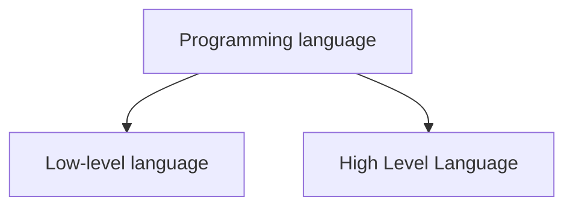

# 🏷️Introduction to Java

## 📂Programming language
🔹 Programming language is used to communicate with machines

## 📂Low-level language
🔹 A language which is easily readable & understandable by maching is known as low-level language or machine language.
⚡ Binary language

## 📂High-level language
🔹 A language which is easily readable, understandable & instructable by human or programmer is known as high level language
⚡ Java, C++, python, etc