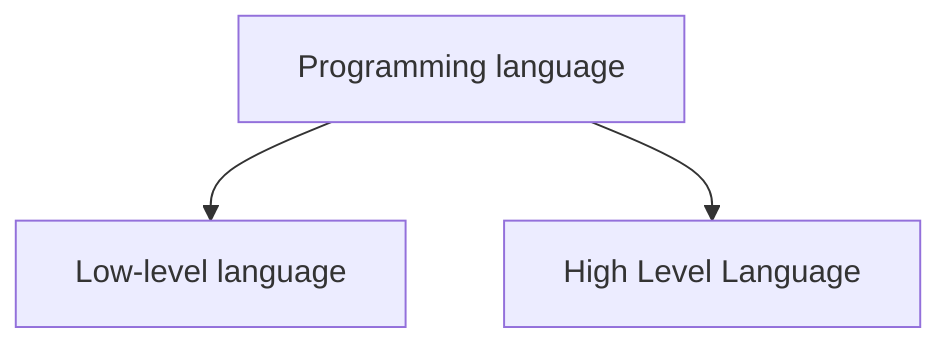
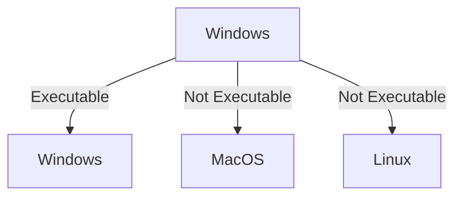
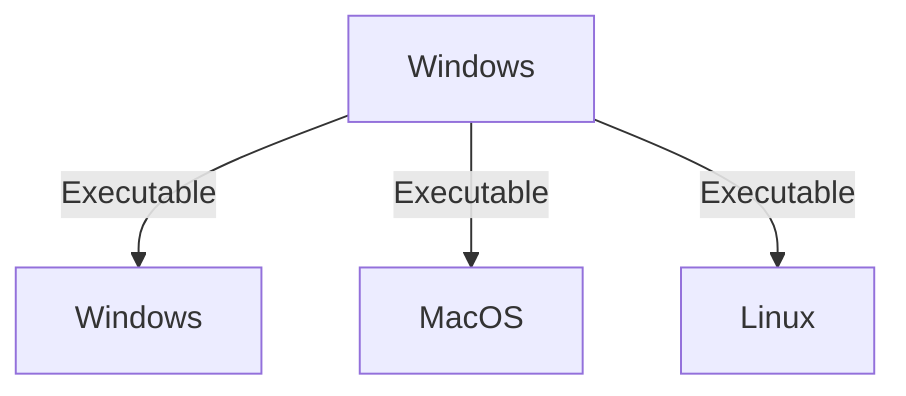

# 🏷️Introduction to Java

## 📂Programming language
🔹 Programming language is used to communicate with machines.

## 📂Low-level language
🔹 A language which is easily readable & understandable by maching is known as low-level language or machine language.  
⚡ Binary language

## 📂High-level language
🔹 A language which is easily readable, understandable & instructable by human or programmer is known as high level language.  
⚡ Java, C++, python, etc

## 📂Platform dependent
🔹If we write a program using one platform an it is executable in same platform is known as platform dependent language.  
⚡Eg. C language

## 📂Platform independent
🔹If we write a program in one platform it is executable in any other platform is known as platform independent language.  
⚡Eg. Java  
🔸Java is executable in windows, macOS and even Linux
