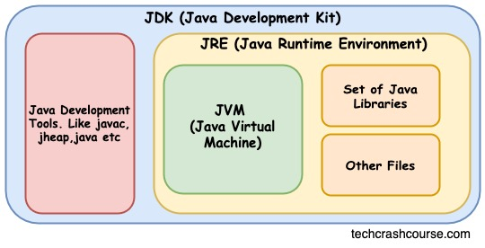

# 🏷️Difference between JVM, JRE & JDK

## 📂JVM
🔹 1. JVM stands for java virtual machine.  
🔹 2. JVM physicall does not exist hence virtual.  
🔹 3. JVM takes byte code as input and generates binary code as output.  
🔹 4. JVM consist of interpreter and JIT.  

 
⚡The Java compiler, javac, is platform-dependent. While Java bytecode (.class files) is platform-independent, allowing it to be run on any system with a compatible Java Virtual Machine (JVM).
 

🔹 5. Interpreter  
   📑 a. Interpreter checks and executes bytecode simultaneously.
   📑 b. Interpreter takes more time to execute.
 

🔹 6. JIT (Just-In-Time)  
   📑 a. JIT is used to increase the speed of execution.  
   📑 b. JIT identifies the set of programs which are having same functionality then compiles at once & gives to the interpreter.  

## 📂JRE (Java runtime environment)
🔹 1. JRE provides an environment to run a java program.  
🔹 2. JRE physically exist.  
🔹 3. JRE consist of inbuilt libraries and jvm.  

## 📂JDK (Java development kit)
🔹 1. JDK provides an environment to run & develop a java program.  
🔹 2. JDK physically exist.  
🔹 3. JDK consist of development tools and jre.  

